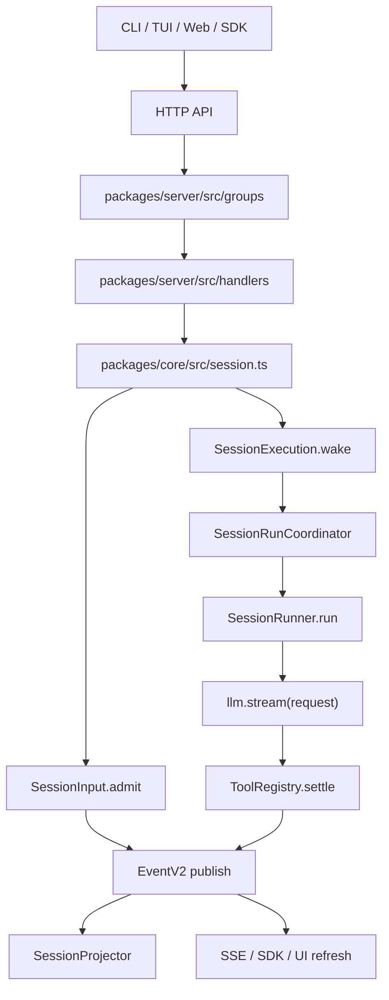

# opencode 二次开发指南

这份指南面向已经有 Java/Go 后端经验，但 TypeScript 经验较少，并且希望通过参与 opencode 开源贡献来学习 coding agent 原理的开发者。它不是一份“把命令列出来”的速查表，而是一条从跑起来、看懂调用链、修改代码、调试验证，到提交 PR 的实战路线。

本文基于当前仓库结构编写。opencode 正在从 legacy session 执行链逐步演进到 V2 session core，代码里会同时看到两套路径。阅读时先接受这一点：不是所有入口都已经完全迁到 V2。

## 1. 先建立全局地图

### 1.1 仓库里最重要的包

| 路径 | 作用 | 你什么时候会看它 |
| --- | --- | --- |
| `packages/opencode` | CLI 入口、legacy API server、legacy session prompt 执行链、TUI worker 启动 | 改命令行、`bun dev`、老 `/session/*` API、TUI 启动流程 |
| `packages/core` | V2 领域核心：session、event、database、tool、permission、system-context、provider/model 抽象 | 学 coding agent 主循环、工具调用、事件投影、持久化 |
| `packages/server` | V2 experimental HTTP API：`/api/*` 的 typed API groups 和 handlers | 改 V2 API、生成 SDK |
| `packages/llm` | LLM 协议和 provider route 抽象，统一把各家模型流转换成 opencode 内部事件 | 改模型协议、tool-call streaming、provider 适配 |
| `packages/sdk/js` | JS SDK，主要由 OpenAPI 生成 | API schema 变化后必须关注 |
| `packages/tui` | 终端 UI，SolidJS + OpenTUI | 改 TUI 界面、快捷键、交互 |
| `packages/app` | Web UI，SolidJS + Vite | 改浏览器端界面、session 页面、设置页 |
| `packages/desktop` | Electron 桌面壳，包装 `packages/app` | 改桌面能力、窗口、自动更新、本地集成 |
| `packages/plugin` | 插件 SDK | 改插件能力或示例 |
| `packages/ui` | Web UI 共享组件 | 改通用按钮、tabs、dialog、theme 等 |
| `packages/docs` / `packages/web` | 文档站内容与站点 | 改官网文档 |

### 1.2 运行时主线

当前最值得你反复追踪的是这条 V2 coding agent 主线：



这条线背后的核心思想是：

- 用户输入先持久化，再调度模型执行。
- Session 执行由 Session ID 协调，同一个 Session 本地只跑一个 drain，不同 Session 可以并发。
- 每个 provider turn 只调用一次 `llm.stream(request)`。
- 工具调用先记录，再执行，再把工具结果持久化，必要时继续下一轮 provider turn。
- UI 和 SDK 不应该依赖内存状态，而是通过事件和投影恢复状态。

## 2. 环境搭建

### 2.1 必备工具

推荐先准备：

- Bun 1.3+，仓库 `package.json` 当前声明 `bun@1.3.14`。
- Git。
- `rg` / ripgrep，用来快速搜代码。
- VSCode 或 JetBrains 系列 IDE。VSCode 可安装 Bun 插件。
- Windows 用户建议使用 PowerShell 7 或 Windows Terminal。

确认版本：

```powershell
bun --version
git --version
rg --version
```

如果在 Windows sandbox 或不同用户下看到 Git 的 dubious ownership 报错，可以执行一次：

```powershell
git config --global --add safe.directory C:/Users/shuwe/CodeProjects/open-source/opencode
```

这是 Git 的安全保护，不是 opencode 本身的问题。

### 2.2 安装依赖

在仓库根目录运行：

```powershell
bun install
```

`postinstall` 会跑 `packages/core` 的 `fix-node-pty` 脚本。TUI 和 desktop 都依赖 pty/native 包，如果安装阶段在 Windows 上失败，优先检查：

- Bun 版本是否过旧。
- 是否使用了公司代理或镜像导致 optional native 包没下全。
- 是否在路径很深或含特殊权限限制的目录里。

### 2.3 先跑起来

查看 CLI：

```powershell
bun dev --help
```

在当前仓库启动 TUI：

```powershell
bun dev .
```

在另一个项目目录启动 TUI：

```powershell
bun dev C:\path\to\your-project
```

启动 headless API server：

```powershell
$env:OPENCODE_SERVER_PASSWORD = "dev"
bun dev serve --hostname 127.0.0.1 --port 4096
```

另开一个终端验证 V2 health API：

```powershell
$pair = [Convert]::ToBase64String([Text.Encoding]::ASCII.GetBytes("opencode:dev"))
Invoke-RestMethod http://127.0.0.1:4096/api/health -Headers @{ Authorization = "Basic $pair" }
```

启动 Web UI，需要先保持 server 运行：

```powershell
bun run --cwd packages/app dev
```

默认 Web UI 会连 `http://localhost:4096`，也可以通过环境变量指定：

```powershell
$env:VITE_OPENCODE_SERVER_HOST = "127.0.0.1"
$env:VITE_OPENCODE_SERVER_PORT = "4096"
bun run --cwd packages/app dev
```

启动桌面 app：

```powershell
bun run --cwd packages/desktop dev
```

构建本机单文件命令：

```powershell
bun .\packages\opencode\script\build.ts --single
```

类 Unix shell 也可以用：

```bash
./packages/opencode/script/build.ts --single
```

## 3. TypeScript 和 Effect 入门路线

### 3.1 从 Java/Go 迁移时最容易卡住的点

TypeScript 是结构类型系统。很多地方不是“实现某个 interface”，而是“形状对得上就可以”。opencode 又大量依赖类型推导，所以你会看到很多函数没有显式返回类型，这是仓库风格。

常见写法：

```ts
const ListInput = Schema.Union([ListDirectoryInput, ListProjectInput, ListAllInput])
export type ListInput = typeof ListInput.Type
```

这里 `Schema` 同时承担运行时校验和静态类型推导的职责，类似 Java 里 DTO + validator + OpenAPI schema 的组合，但更靠近代码。

### 3.2 Effect 在这个仓库里的角色

你可以先把 Effect 理解为三件事：

- `Effect.Effect<A, E, R>`：一个会产生 `A`，可能失败为 `E`，需要环境依赖 `R` 的计算。
- `Context.Service`：类似依赖注入里的 Service token。
- `Layer`：类似 Spring/Go wire 里的 provider graph，把服务装配起来。

典型代码：

```ts
export class Service extends Context.Service<Service, Interface>()("@opencode/v2/Session") {}

export const layer = Layer.effect(
  Service,
  Effect.gen(function* () {
    const db = (yield* Database.Service).db
    const events = yield* EventV2.Service
    return Service.of({
      get: Effect.fn("V2Session.get")(function* (sessionID) {
        ...
      }),
    })
  }),
)
```

读法：

1. `Service` 是依赖注入的 key。
2. `layer` 构造这个 service。
3. `yield* Database.Service` 表示从运行环境取依赖。
4. `Effect.fn("Name")` 给 effectful 函数命名，便于 tracing 和调试。
5. `.pipe(Layer.provide(...))` 是装配依赖。

Effect 错误通常通过 typed error 建模：

```ts
export class NotFoundError extends Schema.TaggedErrorClass<NotFoundError>()("Session.NotFoundError", {
  sessionID: SessionSchema.ID,
}) {}
```

处理时常见：

```ts
Effect.catchTag("Session.NotFoundError", ...)
Effect.orDie
Effect.catchDefect
```

不要急着一次看懂所有 Effect API。先按调用链读，把 `Effect.gen` 当成“可以 yield 异步/依赖/失败的函数体”即可。

## 4. 一步一步看懂代码

### 4.1 第一步：从 CLI 入口开始

入口文件：

- `packages/opencode/src/index.ts`

它用 `yargs` 注册命令：

- 默认 TUI：`TuiThreadCommand`
- 非交互执行：`RunCommand`
- API server：`ServeCommand`
- Web：`WebCommand`
- Debug：`DebugCommand`
- Provider、model、session、plugin 等子命令

建议阅读顺序：

1. `packages/opencode/src/index.ts`
2. `packages/opencode/src/cli/cmd/tui.ts`
3. `packages/opencode/src/cli/cmd/run.ts`
4. `packages/opencode/src/cli/cmd/serve.ts`
5. `packages/opencode/src/cli/cmd/debug/index.ts`

对应命令：

```powershell
bun dev --help
bun dev debug info
bun dev debug paths
bun dev debug v2
```

### 4.2 第二步：理解 server 如何启动

server 入口：

- `packages/opencode/src/server/server.ts`

关键点：

- `Server.Default().app.fetch(...)` 提供 in-process fetch，CLI/TUI 可以不走真实 TCP。
- `Server.listen(...)` 才是真的监听端口。
- `HttpApiApp.createRoutes(opts)` 组合所有 HTTP routes。

继续看：

- `packages/opencode/src/server/routes/instance/httpapi/server.ts`
- `packages/opencode/src/server/routes/instance/httpapi/api.ts`

这里会看到两类 API 被挂到一起：

- legacy instance API，例如 `/session/*`、`/config/*`。
- V2 experimental API，例如 `/api/session/*`，来自 `packages/server`。

### 4.3 第三步：分清 legacy session 和 V2 session

legacy session 路径：

- API definition：`packages/opencode/src/server/routes/instance/httpapi/groups/session.ts`
- handler：`packages/opencode/src/server/routes/instance/httpapi/handlers/session.ts`
- 执行核心：`packages/opencode/src/session/prompt.ts`

V2 session 路径：

- API definition：`packages/server/src/groups/session.ts`
- handler：`packages/server/src/handlers/session.ts`
- core service：`packages/core/src/session.ts`
- input inbox：`packages/core/src/session/input.ts`
- execution：`packages/core/src/session/execution/local.ts`
- coordinator：`packages/core/src/session/run-coordinator.ts`
- runner：`packages/core/src/session/runner/llm.ts`

如果你改的是 `/api/session/:sessionID/prompt`，先看 V2。

如果你改的是旧 SDK 或 Web UI 仍在调用的 `/session/:sessionID/message`，先看 legacy。

### 4.4 第四步：沿着 V2 prompt 调用链读

从 API 开始：

1. `packages/server/src/groups/session.ts`
   - `HttpApiEndpoint.post("session.prompt", "/api/session/:sessionID/prompt", ...)`
   - 定义 params、payload、success、error。

2. `packages/server/src/handlers/session.ts`
   - `.handle("session.prompt", ...)`
   - 调用 `SessionV2.Service.prompt(...)`。

3. `packages/core/src/session.ts`
   - `prompt(...)` 先 `result.get(sessionID)`。
   - 决定 `messageID` 和 `delivery`。
   - 调用 `SessionInput.admit(...)`。
   - 如果 `resume !== false`，调用 `execution.wake(...)`。

4. `packages/core/src/session/input.ts`
   - `admit(...)` 发布 `SessionEvent.PromptLifecycle.Admitted`。
   - projector 会把 durable input 写入 `session_input` 投影表。
   - `delivery` 有两个值：
     - `steer`：默认，当前活动下一安全边界合并进去。
     - `queue`：排到未来 FIFO activity。

5. `packages/core/src/session/execution/local.ts`
   - 用 `SessionRunCoordinator` 保证一个 Session 同时只有一条 drain 链。
   - 根据 session.location 找到正确的 Location-scoped layer。

6. `packages/core/src/session/run-coordinator.ts`
   - `run` 是显式执行请求。
   - `wake` 是 advisory wakeup，表示有 durable work 可以 drain。
   - active 时重复 wake 会合并，不会开很多并发 runner。
   - `interrupt` 会中断当前 owner fiber，并抑制旧 wake。

7. `packages/core/src/session/runner/llm.ts`
   - `SessionInput.hasPending(...)` 判断是否有 steer/queue。
   - `SessionInput.promoteSteers(...)` 或 `promoteNextQueued(...)` 把 inbox 输入提升为可见 user message。
   - `SessionHistory.entriesForRunner(...)` 读取投影后的历史。
   - `tools.materialize(...)` 得到模型可见工具定义。
   - `llm.stream(request)` 开始 provider turn。
   - 遇到 tool-call，调用 `toolMaterialization.settle(...)`。
   - 工具结果作为 `LLMEvent.toolResult(...)` 发布。
   - 如果有工具调用或新的 steer，就继续下一轮 provider turn。

这条链建议你边读边打断点。不要直接从 `runner/llm.ts` 硬啃，先从 HTTP handler 进入，代码会自己带你往下走。

### 4.5 第五步：理解工具系统

V2 工具核心：

- `packages/core/src/tool/tool.ts`
- `packages/core/src/tool/registry.ts`
- `packages/core/src/tool/application-tools.ts`
- `packages/core/src/tool/read.ts`
- `packages/core/src/tool/write.ts`
- `packages/core/src/tool/edit.ts`
- `packages/core/src/tool/bash.ts`
- `packages/core/src/tool/grep.ts`
- `packages/core/src/tool/glob.ts`

legacy 工具：

- `packages/opencode/src/tool/*`

V2 registry 的读法：

- `register(...)`：注册工具。
- `materialize(permissions)`：根据权限规则产出给模型看的 tool definitions。
- `settle(...)`：执行工具，把返回值变成 LLM tool result，并通过 `ToolOutputStore` 处理大输出。

做工具相关贡献时，优先确认你改的是 V2 还是 legacy。很多工具有两份实现，不要在错的路径里改半天。

### 4.6 第六步：理解 LLM/provider 层

相关路径：

- `packages/llm/src/llm.ts`
- `packages/llm/src/schema`
- `packages/llm/src/protocols/*`
- `packages/llm/src/providers/*`
- `packages/core/src/provider.ts`
- `packages/core/src/model.ts`
- `packages/core/src/models-dev.ts`

大致分层：

- `packages/core` 负责选择“哪个 provider/model”。
- `packages/llm` 负责把 opencode request 转成 provider HTTP request，再把 streaming response 转成统一的 `LLMEvent`。
- provider 支持优先通过 `models.dev` 配置扩展。贡献新 provider 前先看 `CONTRIBUTING.md`，通常不应该直接大改主仓库。

### 4.7 第七步：理解 UI

TUI：

- 启动命令：`packages/opencode/src/cli/cmd/tui.ts`
- worker：`packages/opencode/src/cli/tui/worker.ts`
- TUI app：`packages/tui/src/app.tsx`
- context：`packages/tui/src/context/*`
- routes/components：`packages/tui/src/routes`、`packages/tui/src/component`

Web App：

- entry：`packages/app/src/entry.tsx`
- app providers/router：`packages/app/src/app.tsx`
- session 页面：`packages/app/src/pages/session.tsx`
- session 子组件：`packages/app/src/pages/session/*`
- SDK context：`packages/app/src/context/sdk.tsx`、`packages/app/src/context/server-sdk.tsx`

Web UI 是 SolidJS，不是 React。Solid 的 `createSignal`、`createMemo`、`createEffect` 类似“细粒度响应式”，组件函数不会像 React 那样反复整体 render。

## 5. 常用开发命令

### 5.1 根目录命令

```powershell
bun install
bun dev --help
bun dev .
bun dev serve --port 4096
bun run --cwd packages/app dev
bun run --cwd packages/desktop dev
bun run lint
bun .\script\format.ts
```

不要在根目录跑测试：

```powershell
bun test
```

根目录 `test` 是保护脚本，会提示不要从 root 跑。

### 5.2 类型检查

按仓库约定，从包目录运行 `bun typecheck`，不要直接跑 `tsc`：

```powershell
Push-Location packages\core
bun typecheck
Pop-Location

Push-Location packages\opencode
bun typecheck
Pop-Location

Push-Location packages\app
bun typecheck
Pop-Location
```

### 5.3 测试

按包运行：

```powershell
Push-Location packages\core
bun test test\session-runner.test.ts
bun test test\tool-read.test.ts
Pop-Location

Push-Location packages\opencode
bun test test\server\httpapi-v2-location.test.ts
bun test test\session\prompt.test.ts
Pop-Location

Push-Location packages\app
bun test:unit
Pop-Location
```

如果测试依赖真实时间、文件系统、git、子进程，在 `packages/opencode/test/AGENTS.md` 里有 `testEffect`、`it.live`、`it.instance` 等模式说明。

### 5.4 SDK 和 OpenAPI 生成

如果只需要重新生成 JS SDK：

```powershell
bun .\packages\sdk\js\script\build.ts
```

类 Unix shell：

```bash
./packages/sdk/js/script/build.ts
```

如果 API 相关文件变化后需要跑完整生成流程：

```powershell
bun .\script\generate.ts
```

注意：`packages/sdk/js/script/build.ts` 会调用 `bun dev generate` 生成 `packages/sdk/js/openapi.json`，再用 `@hey-api/openapi-ts` 生成 `src/v2/gen`。

## 6. Run 和 Debug 方法

### 6.1 CLI/TUI 调试

最直接：

```powershell
bun dev .
```

如果要打断点，推荐用 Bun inspect + IDE attach。先复制 `.vscode/launch.example.json` 到 `.vscode/launch.json`，或者在 IDE 里手动 attach 到：

```text
ws://localhost:6499/
```

然后用 inspect 启动：

```powershell
bun run --inspect=ws://localhost:6499/ --cwd packages/opencode --conditions=browser .\src\index.ts .
```

常打断点位置：

- `packages/opencode/src/index.ts`
- `packages/opencode/src/cli/cmd/tui.ts`
- `packages/opencode/src/cli/cmd/run.ts`
- `packages/opencode/src/cli/tui/worker.ts`

### 6.2 Server 调试

启动 server：

```powershell
$env:OPENCODE_SERVER_PASSWORD = "dev"
bun run --inspect=ws://localhost:6499/ --cwd packages/opencode --conditions=browser .\src\index.ts serve --port 4096
```

常打断点位置：

- `packages/opencode/src/server/server.ts`
- `packages/opencode/src/server/routes/instance/httpapi/server.ts`
- `packages/server/src/handlers/session.ts`
- `packages/core/src/session.ts`
- `packages/core/src/session/runner/llm.ts`

验证 health：

```powershell
$pair = [Convert]::ToBase64String([Text.Encoding]::ASCII.GetBytes("opencode:dev"))
Invoke-RestMethod http://127.0.0.1:4096/api/health -Headers @{ Authorization = "Basic $pair" }
```

### 6.3 Web UI 调试

先跑 server，再跑 app：

```powershell
$env:OPENCODE_SERVER_PASSWORD = "dev"
bun dev serve --port 4096
```

另开终端：

```powershell
bun run --cwd packages/app dev
```

浏览器打开 Vite 输出的地址，通常是 `http://localhost:5173`。Web UI 断点用浏览器 devtools 或 IDE JS debugger。

常看文件：

- `packages/app/src/entry.tsx`
- `packages/app/src/app.tsx`
- `packages/app/src/pages/session.tsx`
- `packages/app/src/context/server.tsx`
- `packages/app/src/context/server-sdk.tsx`

### 6.4 Desktop 调试

```powershell
bun run --cwd packages/desktop dev
```

先区分问题属于：

- Web UI：改 `packages/app`。
- Electron main/preload/window/native：改 `packages/desktop`。
- Server/agent 逻辑：改 `packages/opencode` 或 `packages/core`。

## 7. 练手修改：从小到大

下面这些练习建议在临时分支上做。做完可以 `git diff` 看变化，再决定保留、继续完善成 PR，或者丢弃练习改动。

### 7.1 练习一：改 CLI help 文案

目标：熟悉 CLI 入口和本地验证。

1. 打开 `packages/opencode/src/cli/cmd/serve.ts`。
2. 修改 `describe: "starts a headless opencode server"` 为更清楚的文案。
3. 验证：

```powershell
bun dev --help
```

4. 跑类型检查：

```powershell
Push-Location packages\opencode
bun typecheck
Pop-Location
```

这个练习适合熟悉 `index.ts -> ServeCommand -> effectCmd`。

### 7.2 练习二：给 V2 health API 加一个字段

目标：熟悉 V2 API schema、handler、SDK 生成。

涉及文件：

- `packages/server/src/groups/health.ts`
- `packages/server/src/handlers/health.ts`
- `packages/sdk/js/src/v2/gen/*`，生成后变化

思路：

1. 在 schema 里把 success 从 `{ healthy: true }` 扩展成 `{ healthy: true, version: string }`。
2. handler 返回 `InstallationVersion`。
3. 跑 server，访问 `/api/health`。
4. 跑 SDK 生成。

验证命令：

```powershell
Push-Location packages\server
bun typecheck
Pop-Location

bun .\packages\sdk\js\script\build.ts

Push-Location packages\sdk\js
bun typecheck
Pop-Location
```

如果这是为了提交 PR，先开 issue 说明为什么 health API 需要 version 字段，因为公共 API 变化会影响 SDK。

### 7.3 练习三：读并改一个 core runner 测试

目标：理解 agent loop，不依赖真实 LLM。

重点文件：

- `packages/core/test/session-runner.test.ts`
- `packages/core/src/session/runner/llm.ts`

这个测试文件自己构造了 fake `LLMClient.Service`，通过 `response` / `responses` / `responseStream` 控制模型流。你可以先只读这些测试：

```powershell
rg "bounds|queue|steer|tool" packages\core\test\session-runner.test.ts
```

运行：

```powershell
Push-Location packages\core
bun test test\session-runner.test.ts
Pop-Location
```

建议先给某个测试加一条更明确的断言，而不是直接改 runner 逻辑。等你能解释“输入如何从 SessionInput 进入 runner，又如何变成 LLM request”后，再动生产代码。

### 7.4 练习四：改 Web UI 的一个低风险文本或状态

目标：熟悉 SolidJS app。

推荐先看：

- `packages/app/src/app.tsx`
- `packages/app/src/pages/session.tsx`
- `packages/app/src/i18n`

验证：

```powershell
bun run --cwd packages/app dev
```

类型检查和单测：

```powershell
Push-Location packages\app
bun typecheck
bun test:unit
Pop-Location
```

UI 变化准备 PR 时要截图或录屏。

## 8. 贡献 bug fix 的完整流程

### 8.1 找 issue

优先找这些标签：

- `good first issue`
- `help wanted`
- `bug`
- `perf`

所有 PR 都需要引用已有 issue。小 bug 也先开一个简短 issue，描述现象、复现步骤、期望行为。

### 8.2 建分支

默认分支是 `dev`，不要假设本地有 `main`：

```powershell
git fetch origin
git switch dev
git pull --ff-only origin dev
git switch -c fix/session-cursor-order
```

如果本地没有 `dev`：

```powershell
git fetch origin
git switch -c dev origin/dev
git switch -c fix/session-cursor-order
```

做 diff 时也用 `dev` 或 `origin/dev`：

```powershell
git diff origin/dev...HEAD
```

### 8.3 定位代码

常用搜索：

```powershell
rg "session.prompt"
rg "/api/session"
rg "SessionRunCoordinator"
rg "ToolRegistry"
rg "HttpApiEndpoint"
rg "createOpencodeClient"
```

定位原则：

- API shape 先看 `groups`，实现看 `handlers`。
- V2 业务逻辑看 `packages/core`。
- legacy CLI/server glue 看 `packages/opencode`。
- UI 调用看 SDK context 和页面组件。
- SDK 类型异常通常来自 OpenAPI schema 或生成产物。

### 8.4 写测试

按改动范围选测试位置：

| 改动类型 | 测试位置 |
| --- | --- |
| V2 session core、工具、持久化 | `packages/core/test` |
| CLI、legacy server、middleware、integration | `packages/opencode/test` |
| LLM protocol/provider route | `packages/llm/test` |
| Web UI 纯逻辑 | `packages/app/src/**/*.test.ts` 或 `*.test.tsx` |
| Web E2E | `packages/app/e2e` |

仓库偏好“测真实实现，少 mock”。如果必须隔离外部模型，参考 `packages/core/test/session-runner.test.ts` 这种 fake service layer，或者 `packages/llm/test/fixtures/recordings` 的 recorded fixtures。

### 8.5 本地验证

最低限度：

```powershell
Push-Location packages\changed-package
bun typecheck
bun test relevant\test-file.test.ts
Pop-Location
```

API 变化：

```powershell
bun .\packages\sdk\js\script\build.ts

Push-Location packages\sdk\js
bun typecheck
Pop-Location
```

UI 变化：

```powershell
Push-Location packages\app
bun typecheck
bun test:unit
Pop-Location
```

最后可以跑 lint：

```powershell
bun run lint
```

### 8.6 提交

提交信息和 PR title 用 conventional commit 风格：

```text
fix(core): handle queued session input after interruption
feat(app): add session filter control
docs: clarify local development setup
test(server): cover v2 session cursor parsing
```

有效 type：

- `feat`
- `fix`
- `docs`
- `chore`
- `refactor`
- `test`

常用 scope：

- `core`
- `opencode`
- `tui`
- `app`
- `desktop`
- `sdk`
- `plugin`

提交前看 diff：

```powershell
git status --short
git diff
git diff --stat
```

提交：

```powershell
git add path\to\files
git commit -m "fix(core): handle queued session input after interruption"
```

### 8.7 PR 描述

PR 描述保持短而具体：

```markdown
Fixes #123

## What changed
- Fixed queued session input promotion after interruption.
- Added a regression test for wake coalescing.

## Verification
- `bun typecheck` in `packages/core`
- `bun test test/session-runner.test.ts` in `packages/core`
```

UI PR 加 before/after 截图或视频。不要贴很长的 AI 生成说明，维护者明确不喜欢这种 PR。

## 9. Feature 实现的建议流程

Feature 比 bug fix 更需要先沟通。推荐流程：

1. 开 feature request issue。
2. 描述用户问题，而不是一上来描述实现。
3. 简述你准备改哪些包和 API。
4. 等维护者确认方向。
5. 做最小可合并切片。
6. 每个切片都有验证方式。

切片示例：

- 第一 PR：只加 core 能力和测试。
- 第二 PR：加 HTTP API 和 SDK 生成。
- 第三 PR：加 UI 入口。
- 第四 PR：补文档。

这样比一个巨大的 full-stack PR 更容易被 review 和合并。

## 10. 代码风格速记

仓库风格以 `AGENTS.md` 为准。最常见规则：

- 尽量把逻辑留在一个函数里，除非 helper 真能命名一个独立概念。
- 不要提前抽只用一次的小 helper。
- 少用 `try/catch`，Effect 代码优先用 `Effect.try`、`catchTag`、`catchDefect`。
- 不用 `any`。
- 能用 Bun API 就用 Bun API，例如 `Bun.file()`。
- 依赖类型推导，避免无意义显式类型。
- 优先 `const`，避免 `let` 和重赋值。
- 避免 `else`，优先 early return。
- 避免不必要的 destructuring，保留 `obj.field` 的上下文。
- 不要 alias import，例如不要写 `import { resolve as pathResolve } from "path"`。
- 不要 star import，例如不要写 `import * as Foo from "./foo"`。
- 重模块只在需要的分支里 dynamic import。
- Drizzle schema 字段用 snake_case，避免手写列名字符串。
- `src/config` 新模块要遵循现有 self-export pattern。

例子：

```ts
const journal = await Bun.file(path.join(dir, "journal.json")).json()
```

不要写成：

```ts
const journalPath = path.join(dir, "journal.json")
const journal = await Bun.file(journalPath).json()
```

## 11. 常见改动入口速查

### 11.1 改 CLI 命令

看：

- `packages/opencode/src/index.ts`
- `packages/opencode/src/cli/cmd/*`
- `packages/opencode/src/cli/effect-cmd.ts`
- `packages/opencode/src/cli/cmd/cmd.ts`

验证：

```powershell
bun dev --help
bun dev <command> --help
```

### 11.2 改 V2 API

看：

- `packages/server/src/groups/*`
- `packages/server/src/handlers/*`
- `packages/server/src/errors.ts`
- `packages/server/src/middleware/*`
- `packages/opencode/src/server/routes/instance/httpapi/server.ts`

变更后：

```powershell
bun .\packages\sdk\js\script\build.ts
```

### 11.3 改 legacy API

看：

- `packages/opencode/src/server/routes/instance/httpapi/groups/*`
- `packages/opencode/src/server/routes/instance/httpapi/handlers/*`
- `packages/opencode/src/server/routes/instance/httpapi/public.ts`

变更后也可能需要生成 SDK 或 OpenAPI。

### 11.4 改 agent loop

V2：

- `packages/core/src/session.ts`
- `packages/core/src/session/input.ts`
- `packages/core/src/session/run-coordinator.ts`
- `packages/core/src/session/execution/local.ts`
- `packages/core/src/session/runner/llm.ts`
- `packages/core/src/session/runner/to-llm-message.ts`
- `packages/core/src/session/runner/publish-llm-event.ts`
- `packages/core/src/session/history.ts`
- `packages/core/src/session/projector.ts`

legacy：

- `packages/opencode/src/session/prompt.ts`
- `packages/opencode/src/session/processor.ts`
- `packages/opencode/src/session/llm.ts`
- `packages/opencode/src/session/run-state.ts`

### 11.5 改工具

V2：

- `packages/core/src/tool/*`
- `packages/core/test/tool-*.test.ts`

legacy：

- `packages/opencode/src/tool/*`
- `packages/opencode/test/tool/*`

### 11.6 改配置

看：

- `packages/core/src/config.ts`
- `packages/core/src/config/*`
- `packages/opencode/src/config/*`
- `packages/opencode/test/config/*`

添加 `packages/core/src/config` 模块时注意 self-export pattern。

### 11.7 改 Web UI

看：

- `packages/app/src/app.tsx`
- `packages/app/src/pages/*`
- `packages/app/src/components/*`
- `packages/app/src/context/*`
- `packages/ui/src/*`

验证：

```powershell
bun run --cwd packages/app dev
```

### 11.8 改 TUI

看：

- `packages/opencode/src/cli/cmd/tui.ts`
- `packages/opencode/src/cli/tui/worker.ts`
- `packages/tui/src/app.tsx`
- `packages/tui/src/context/*`
- `packages/tui/src/component/*`

验证：

```powershell
bun dev .
```

## 12. Coding agent 原理在 opencode 中的落点

### 12.1 Session 是 durable aggregate

V2 session 把用户输入、assistant message、tool call、tool result、状态变化都建模成事件，然后投影成可查询的表。这样做的好处是：

- 进程崩溃后可以根据 durable history 恢复。
- UI 可以通过事件流增量刷新。
- 并发输入可以通过 admitted/promoted 生命周期明确排序。
- 测试可以直接断言事件和投影结果。

核心文件：

- `packages/core/src/event.ts`
- `packages/core/src/session/event.ts`
- `packages/core/src/session/projector.ts`
- `packages/core/src/session/sql.ts`

### 12.2 Prompt admission 和 model execution 分离

`SessionV2.prompt(...)` 不直接调用模型。它先 admission：

```text
session_input row / admitted event -> advisory wake -> runner drain
```

这样即使调用者断开，输入也已经 durable。runner 什么时候执行，是调度问题，不是 API 请求生命周期问题。

### 12.3 One provider turn

`SessionRunner.runTurnAttempt(...)` 每次只做一个 provider turn：

```text
prepare context -> materialize tools -> llm.stream(request) -> publish events -> settle tools
```

如果工具调用需要继续，它再进入下一轮。不要把 orchestration 偷偷塞到 provider 里，也不要绕回 legacy `SessionPrompt.loop(...)`。

### 12.4 Tools 是 agent 能力边界

模型只能看到 tool definition。真正执行在 registry 里，执行前后都要通过 permission、output store、event publish。

这对安全非常关键：

- 模型不能直接写文件。
- 工具执行可被权限系统控制。
- 工具输出过大时可以被 `ToolOutputStore` 截断/落盘。
- tool result 会回到模型上下文，用于下一轮推理。

### 12.5 System context 是可组合上下文

V2 把系统上下文放在：

- `packages/core/src/system-context`
- `packages/core/src/session/context-epoch.ts`

主意图是把内置上下文、技能指导、agent system prompt、历史选择等拆开，不再散落在一个巨大的 prompt builder 里。

## 13. 典型排障

### 13.1 `bun test` 从 root 失败

这是故意的。切到包目录跑：

```powershell
Push-Location packages\core
bun test
Pop-Location
```

### 13.2 Windows 无法直接执行 `./script.ts`

PowerShell 对 shebang 支持和 Unix shell 不一样。用 Bun 显式运行：

```powershell
bun .\packages\sdk\js\script\build.ts
bun .\script\generate.ts
```

### 13.3 改 API 后 SDK 类型不对

检查：

1. 是否改了 `groups/*` 的 Schema。
2. 是否跑了 `bun .\packages\sdk\js\script\build.ts`。
3. 是否 `packages/sdk/js/src/v2/gen` 有变化。
4. 是否 `packages/sdk/js/script/build.ts` 里的 patch 仍然应用成功。

### 13.4 断点打不到

优先用 attach，不要优先用 launch：

```powershell
bun run --inspect=ws://localhost:6499/ --cwd packages/opencode --conditions=browser .\src\index.ts serve --port 4096
```

VSCode attach 到 `ws://localhost:6499/`。

### 13.5 Provider 相关测试需要真实网络

先找 recorded test 和 fixture。不要为了一个普通 PR 引入真实 provider 网络依赖。`packages/llm/test/fixtures/recordings` 里有大量 recorded responses。

## 14. 推荐学习路线

第一阶段：跑起来和改小东西。

1. `bun install`
2. `bun dev --help`
3. `bun dev .`
4. 改 CLI help 文案，跑 `packages/opencode` typecheck。

第二阶段：读 V2 API。

1. 从 `packages/server/src/groups/session.ts` 找 `/api/session/:sessionID/prompt`。
2. 进入 `packages/server/src/handlers/session.ts`。
3. 进入 `packages/core/src/session.ts`。
4. 画出 admission/wake/runner 的流程。

第三阶段：读 runner 测试。

1. 读 `packages/core/test/session-runner.test.ts` 顶部 fake LLM setup。
2. 找 steer、queue、tool、interrupt、step limit 的测试。
3. 跑单文件测试。

第四阶段：读工具。

1. 从 `packages/core/src/tool/registry.ts` 开始。
2. 选 `read.ts`、`write.ts`、`bash.ts` 中一个深入。
3. 对应跑 `packages/core/test/tool-*.test.ts`。

第五阶段：读 UI。

1. Web：`packages/app/src/app.tsx` 到 `pages/session.tsx`。
2. TUI：`packages/opencode/src/cli/cmd/tui.ts` 到 `packages/tui/src/app.tsx`。
3. 看 SDK context 如何订阅事件和刷新状态。

第六阶段：做一个真实 issue。

1. 找小 bug。
2. 写最小复现测试。
3. 修生产代码。
4. 跑相关 package 的 typecheck/test。
5. 写短 PR。

## 15. 提交前 checklist

- 已经基于 `dev` 或 `origin/dev`。
- PR 引用了 issue。
- 改动范围小而聚焦。
- 没有无关格式化或生成物。
- 没有 `any`、不必要 destructuring、alias import、star import。
- 没有从 root 跑测试，也没有直接跑 `tsc`。
- 相关 package 已跑 `bun typecheck`。
- 相关测试已跑。
- API 变化已重新生成 SDK。
- UI 变化有截图或录屏。
- PR title 是 conventional commit 风格。

## 16. 最后给你的阅读建议

不要试图一次性读完整个仓库。opencode 的代码量已经足够大，而且处于 V2 session core 演进期。最有效的方法是每次抓一条真实用户路径：

```text
命令或 HTTP endpoint -> handler -> service -> event/db -> runner/tool/provider -> event -> UI
```

你有 Java/Go 后端经验，这是优势。把 Effect layer 当成依赖注入，把 Schema 当成 DTO + validator + OpenAPI，把 runner 当成 durable job processor，把 tools 当成受权限控制的 capability。这样读，TypeScript 的语法噪音会慢慢退到背景里，coding agent 的骨架会越来越清楚。
